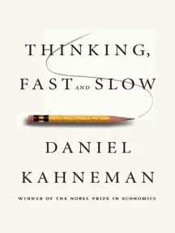

# 🚀 Hybrid Search Agent with Step-by-Step Execution

---
Current README is primarily generated by AI with crucial adjustments about painless installation instructions
---

---
Contributors are welcome!
---

### Introduction
A powerful hybrid search agent that combines local document search, web search (DuckDuckGo), and web scraping (Playwright) with an innovative step-by-step execution mode. Perfect for complex research tasks, document analysis, and automated web interactions.

### [Colab example link with russian explanation](https://colab.research.google.com/drive/1BETnEIxmYr3Ttvfk5mBpCtFyFSqplods#scrollTo=FKYTn686B46W) 🇷🇺


# ✨ Features
### 🔍 Multi-Source Search
Local Document Search: Search through your PDFs, text files, and documents using vector embeddings

Web Search: DuckDuckGo integration for internet searches (no API key required)

Web Scraping: Full browser automation with Playwright for dynamic content

### 🎯 Step-by-Step Execution
Automatic Task Decomposition: Complex queries are broken down into logical steps

Interactive Control: Approve, skip, or modify each step before execution

Execution History: Complete history of all steps with tool calls and results

Auto Mode: Toggle between manual and automatic execution

### 📦 Model Management
Auto-download: Models are automatically downloaded on first use

Multiple Models: Support for various GGUF models (TinyLlama, Mistral, QVikhr, Saiga, etc.)

Smart Caching: Downloaded models are stored locally in ./models/

Model Selection: Choose models by simple names (e.g., `tinyllama`, `qvikhr-3-4b-q3`)

### 🛠️ Advanced Tools
Document Q&A: Semantic search over your documents

Web Navigation: Navigate to URLs, click elements, fill forms

Content Extraction: Extract text, hyperlinks, take screenshots, save as PDF

JavaScript Execution: Run custom JS on web pages

### 📊 Monitoring & Debugging
Phoenix Tracing: Full OpenTelemetry integration with Phoenix

Step History: JSON-formatted execution plans saved locally

Logging: Comprehensive logging with Loguru

Screenshots: Automatic screenshot capture during web interactions


---
# 🏗️ Architecture
- Project statistics are lower
```
hybrid_search_agent/
├── core/               # Core agent logic
│   ├── hybrid_agent.py    # Main hybrid search agent
│   └── step_history.py    # Execution history management
├── agents/            # Agent implementations
│   └── step_by_step_agent.py  # Step-by-step execution agent
├── models/           # Data models
│   └── step_models.py      # Step and plan data structures
├── sessions/         # Session management
│   └── interactive.py     # Interactive chat sessions
├── utils/           # Utilities
│   ├── model_utils.py     # Model download & management
│   ├── display.py         # Console display helpers
│   ├── setup.py          # Initialization utilities
│   └── tracing.py        # Tracing configuration
└── config.py        # Configuration settings
```

---
# 📋 Prerequisites
Python 3.12 or higher

4GB+ RAM (8GB+ recommended)

GPU optional but recommended for larger models

Internet connection for model downloads and web searches

---
# 🚀 Quick Start
### 1. Installation
```bash
# Clone the repository
git clone https://github.com/yourusername/hybrid-search-agent.git
cd hybrid-search-agent

# Create virtual environment
python -m venv .venv
source .venv/bin/activate  # On Windows: .venv\Scripts\activate

# Install dependencies
CMAKE_ARGS="-DGGML_CUDA=on" FORCE_CMAKE=1  uv pip install -r requirements.txt --extra-index-url https://abetlen.github.io/llama-cpp-python/whl/cu124 #--no-cache-dir --force-reinstall

# Install Playwright browsers
playwright install chromium
```
### 2. Basic usage
```python
import asyncio
from hybrid_search_agent.sessions.interactive import create_new_session, interactive_chat_session

async def main():
    # Create a session with TinyLlama (auto-downloads if not present)
    agent = await create_new_session(
        model="tinyllama",  # Model name or path
        step_by_step_mode=True,  # Enable step-by-step execution
        visible=True  # Show browser window
    )
    
    # Start interactive chat
    await interactive_chat_session(agent)

if __name__ == "__main__":
    asyncio.run(main())
```

### 3. Command line interface

```bash
# Run with step-by-step mode and visible browser
python run.py --step-by-step --visible --model tinyllama

# Quick query (non-interactive)
python run.py --model tinyllama --query "What is artificial intelligence?"

# List downloaded models
python run.py --list-models

# Download a specific model
python run.py --download qvikhr-3-4b-q3

# Run with Russian model
python run.py --step-by-step --visible --model qvikhr-3-4b-q3
```

### 4. Step-by-step mode demo
```
🎯 Your question: Find recent AI news and take a screenshot

📋 EXECUTION PLANNING
================================================================
📌 Step 1: Search for recent AI news using duckduckgo_search
📌 Step 2: Navigate to the first result URL
📌 Step 3: Extract text from the page
📌 Step 4: Take a screenshot of the page

⚡ Executing: Search for recent AI news using duckduckgo_search
✅ Step 1 completed successfully!
📊 Result: Found 10 results about recent AI developments...

⏸️ Step 1 completed. Continue? 
   [Enter] - continue
   [n] - next step
   [s] - skip step
   [a] - enable auto-execution
   [p] - show plan
```

# 🤖 Available Models

## English Models 🇬🇧
- Key	Model	Size	Description
- tinyllama	TinyLlama 1.1B	0.7GB	Lightweight, fast
- llama2-7b	Llama 2 7B	4.1GB	Balanced performance
- mistral-7b	Mistral 7B	4.1GB	Excellent quality
- zephyr-7b	Zephyr 7B	4.1GB	Instruct-tuned
- phi-2	Phi-2 2.7B	1.6GB	Compact, capable

## Russian Models 🇷🇺
- Key	Model	Size	Description
- `qvikhr-3-4b-q3`	QVikhr 3.4B	2.1GB	Russian instruction model based on Qwen3 (tested) 
- `qvikhr-3-8b-q3`	QVikhr 8B	4.3GB	Bigger Qvikhr
- `saiga-7b`	Saiga 7B	4.1GB	Russian old model

# 📚 Usage Examples

1. Local Document Search

```python
# Add documents to local index
await agent.add_document("./path/to/document.pdf")

# Search local documents
response = await agent.query("What information do we have about project X?")
```

2. Web Search with Screenshot

```python
# Step-by-step execution will show each phase
response = await agent.query_step_by_step(
    "Find information about climate change and save a screenshot of the top result"
)
```

3. Complex Multi-Step Task

```python
# Automatic decomposition into logical steps
async for event in agent.query_step_by_step(
    "Search for Python machine learning tutorials, open the top 3 results, "
    "extract the main content from each, and save them as PDFs"
):
    if event["type"] == "step_created":
        print(f"📌 New step: {event['step'].description}")
```

# ⚙️ Configuration

## Environment Variables (.env)

```bash
# Phoenix Tracing
PHOENIX_HOST=localhost
PHOENIX_PORT=6006
PHOENIX_ENABLED=true

# Model Settings
CONTEXT_WINDOW=6000
TEMPERATURE=0.1
MAX_NEW_TOKENS=1024
```

## Advanced Configuration

```python
agent = await create_new_session(
    model="mistral-7b",
    data_dir="./custom_data",  # Custom document directory
    persist_dir="./custom_storage",  # Custom index storage
    use_gpu=True,  # Enable GPU acceleration
    headless_browser=False,  # Show browser window
    playwright_slow_mo=100,  # Slow down operations (ms)
    step_by_step_mode=True,
    auto_download=True  # Auto-download missing models
)
```

# Project statistics
```python
❯ python project_statistics.py __pycache__ data logs models pdfs screenshots step_history storage .venv .git
2026-02-14 07:31:34 - Analyzing path: .
2026-02-14 07:31:34 - Excluding folders: ['__pycache__', 'data', 'logs', 'models', 'pdfs', 'screenshots', 'step_history', 'storage', '.venv', '.git']
2026-02-14 07:31:34 - Excluding files: .json
2026-02-14 07:31:34 - Max bar length: 30 characters
2026-02-14 07:31:34 - Scanning directory: /home/mg/gh/function-calling-llm-nano
2026-02-14 07:31:35 - Found 30 files with 6261 total lines
2026-02-14 07:31:35 - Largest file: 968 lines

📊 Project Line Count Statistics
======================================================================
Max bar length: 30 chars | Each '█' ≈ 32.3 lines
======================================================================

📁 ./
├── 🗄️ guard_composite.py               826 lines [█████████████████████████░░░░░]
├── 📚 tool_engines.py                  385 lines [███████████░░░░░░░░░░░░░░░░░░░]
├── 📚 project_statistics.py            262 lines [████████░░░░░░░░░░░░░░░░░░░░░░]
├── 📚 phoenix_client.py                255 lines [███████░░░░░░░░░░░░░░░░░░░░░░░]
├── 📚 README.md                        251 lines [███████░░░░░░░░░░░░░░░░░░░░░░░]
├── 📚 phoenix_server.py                205 lines [██████░░░░░░░░░░░░░░░░░░░░░░░░]
├── 📄 guard.py                         172 lines [█████░░░░░░░░░░░░░░░░░░░░░░░░░]
├── 📄 run.py                           111 lines [███░░░░░░░░░░░░░░░░░░░░░░░░░░░]
├── 📄 trace_context.py                  66 lines [██░░░░░░░░░░░░░░░░░░░░░░░░░░░░]
├── 🔸 LICENSE                           21 lines 
├── 🔸 requirements.txt                  13 lines 
└── 🔹 .gitignore                         2 lines 

📁 hybrid_search_agent/
├── 📚 config.py                        212 lines [██████░░░░░░░░░░░░░░░░░░░░░░░░]
├── 📄 main.py                          145 lines [████░░░░░░░░░░░░░░░░░░░░░░░░░░]
└── 🔸 init.py                           17 lines 

📁 hybrid_search_agent/agents/
├── 🗄️ step_by_step_agent.py            968 lines [██████████████████████████████]
└── 🔹 init.py                            5 lines 

📁 hybrid_search_agent/core/
├── 🗄️ hybrid_agent.py                  551 lines [█████████████████░░░░░░░░░░░░░]
├── 📄 step_history.py                  110 lines [███░░░░░░░░░░░░░░░░░░░░░░░░░░░]
└── 🔹 init.py                            6 lines 

📁 hybrid_search_agent/sessions/
├── 🗄️ interactive.py                   570 lines [█████████████████░░░░░░░░░░░░░]
└── 🔹 init.py                            9 lines 

📁 hybrid_search_agent/utils/
├── 📚 model_utils.py                   348 lines [██████████░░░░░░░░░░░░░░░░░░░░]
├── 📚 reduce_context.py                326 lines [██████████░░░░░░░░░░░░░░░░░░░░]
├── 📄 display.py                       162 lines [█████░░░░░░░░░░░░░░░░░░░░░░░░░]
├── 📄 string_processing.py             106 lines [███░░░░░░░░░░░░░░░░░░░░░░░░░░░]
├── 📄 tracing.py                        54 lines [█░░░░░░░░░░░░░░░░░░░░░░░░░░░░░]
├── 🔸 setup.py                          45 lines [█░░░░░░░░░░░░░░░░░░░░░░░░░░░░░]
├── 🔸 validation.py                     37 lines [█░░░░░░░░░░░░░░░░░░░░░░░░░░░░░]
└── 🔸 init.py                           21 lines 

======================================================================
📈 Total lines: 6261
📁 Total files: 30
📊 Largest file: 968 lines

📋 Size Categories:
   🔹 Tiny (<10 lines)    🔸 Small (10-49 lines)    📄 Medium (50-199 lines)
   📚 Large (200-499 lines)    🗄️ Huge (500+ lines)
```